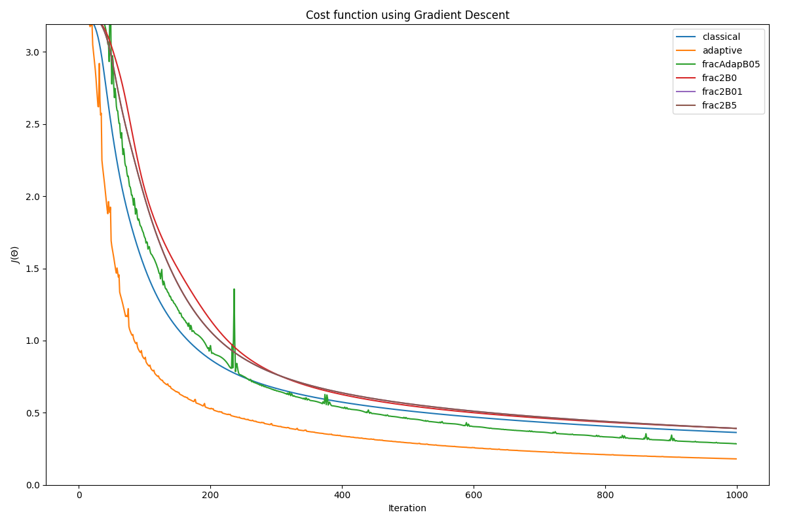

# FracGradient

Repository for the implementation of trained algorithm for gradient descent that uses fractional derivitives.

## Project Structure

The repository is organized as follows:
```
.
├── LICENSE # Project license
├── README.md # Project documentation (this file)
├── datasets/ # Input datasets
│ ├── Happy_datasets # HappyFace dataset
│ └── ex3data1.mat # MNIST Dataset
├── docs/ # Reference papers, reports, and figures
├── results/ # Training outputs and experiment logs
│ ├── output_HappyFace_* # Results for HappyFace experiments
│ ├── output_MNIST_* # Results for MNIST experiments
│ ├── output_cifar10_* # Results for CIFAR-10 experiments
│ └── res.json # Summary of results
└── src/ # Source code for experiments
  ├── ciphar10/ # CIFAR-10 helper code and tensorflow implementation
  ├── impl/ # Core implementation (optimizers, models, etc.)
  ├── main_* # Entry points for each experiment (MNIST, HappyFace, CIFAR-10)
  └── run_all.py # Script to run all experiments sequentially
```

### Notes
- **datasets/** contains the input data used in the experiments.  
- **docs/** includes background papers and diagrams.  
- **results/** stores the outputs of all experiments (loss curves, trained models, JSON summaries).  
- **src/** is the main codebase, where each `main_*` script corresponds to a specific experiment described in the paper.  
- **impl/** inside `src` holds the reusable implementation of the optimizers and models.  
---

Would you like me to make the **experiment naming conventions** (like `main_mnist3_2_hidden_layer_32_16.py`) clearer in the README (e.g., a short legend explaining what each part of the filename means)?


# Results


